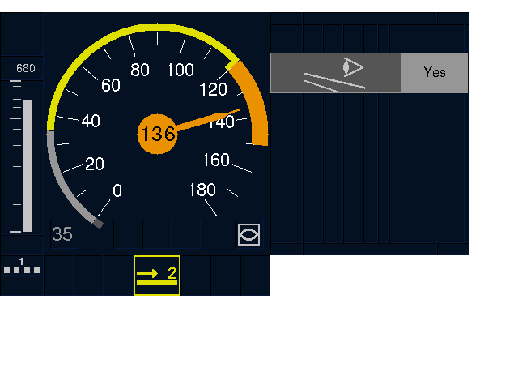
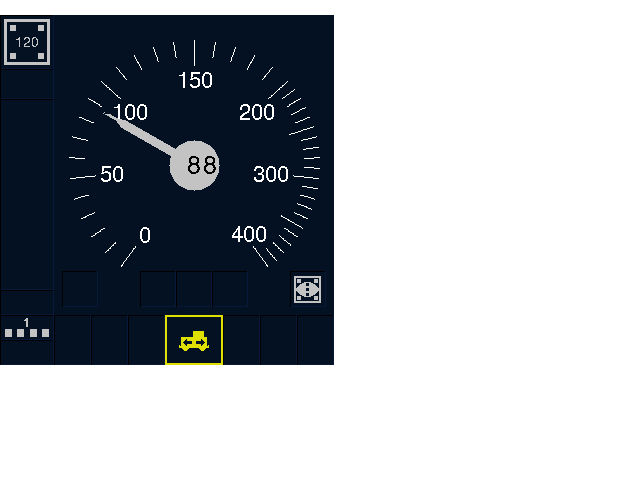

# etcs-dmi

## European Train Control System - Driver Machine Interface (ETCS DMI)
### Goal
My personal goal is to better learn Ada through implementing a well-specified and potentially useful application.

The general goal is to implement Version 3.4.0 of the [ETCS DMI](https://en.wikipedia.org/wiki/European_Train_Control_System#Man_Machine_Interface) according to [specifications published by the European Railway Agency](https://www.era.europa.eu/activities/technical-specifications-interoperability_en#meeting7).
Written in Ada2012 with a strong focus on applicability in resource-limited embedded devices: 
primary performance goal is to run on 32bit 200MHz ARM/POWER MCU with 128kB RAM and 1MB ROM, without OS.

### Zero dependency
No library is used other than provided by GNAT. 

### Fonts
Fonts are embedded as bitmaps in source code. FreeSans font is used due to licensing issues and due to similarity to Helvetica (which is recommended by the ERA).
A Freetype based C-program was used to generate Ada code from the TrueType font. It is easily replacable with other font if needed.

### Testing
To be able to see the output the following setup is used:
- the content of the framebuffer of each display area is sent through a TCP socket to a [server implemented in node.js](test/tools/server.js)
- the node.js server also functions as a WebSocket server
- a web browser based [client is provided](test/tools/client.html)

the above tries to mimic the embedded setup when framebuffer content is sent to the display driver.

