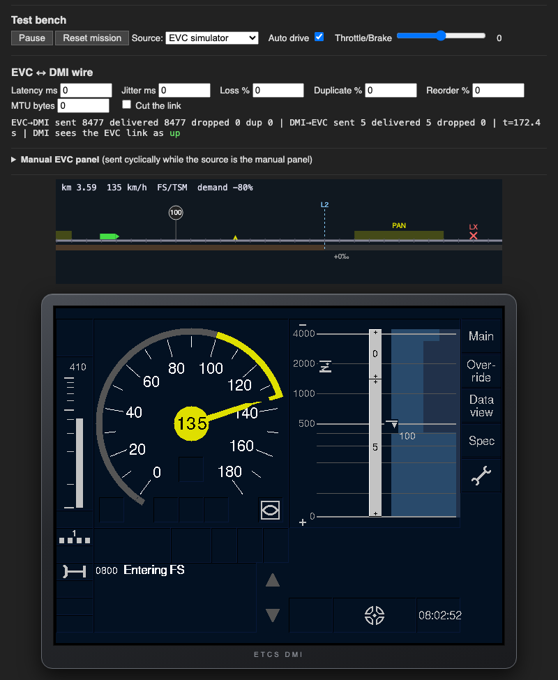
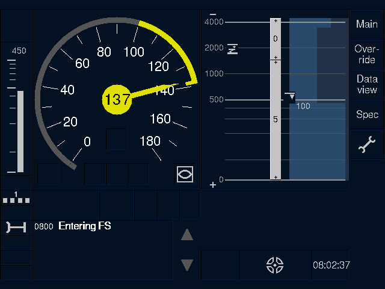
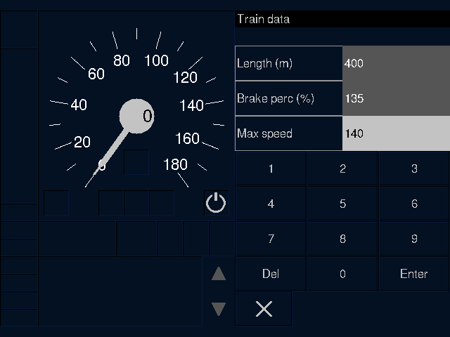

# etcs-dmi

## European Train Control System - Driver Machine Interface (ETCS DMI)

The DMI is the cab display that tells a train driver how fast the train
may go, where it has to brake, which mode and level the on-board system
is in, and what lies ahead on the track. This is an implementation of it
in Ada 2012 for small embedded hardware.

**Live demo**: <https://milanredele.github.io/etcs-dmi/> runs the DMI
and a simulated on-board computer in the browser, compiled from the same
Ada sources to WebAssembly.

[](https://milanredele.github.io/etcs-dmi/)

### Goals
1. **Implement Version 4.0.0 of the
   [ETCS DMI](https://en.wikipedia.org/wiki/European_Train_Control_System#Man_Machine_Interface)**
   according to the
   [specifications published by the European Union Agency for Railways](https://www.era.europa.eu/activities/technical-specifications-interoperability_en#meeting7)
   (ERA_ERTMS_015560 v4.0.0, included under [doc/SRS](doc/SRS)).
   Written in Ada 2012 with a strong focus on applicability in
   resource-limited embedded devices: the primary performance goal is to
   run on a 32-bit 200 MHz ARM/POWER MCU with 128 kB RAM and 1 MB ROM,
   without an OS.
2. **Learn Ada.** My personal goal is to get better at Ada by
   implementing a well-specified and potentially useful application.
3. **Test the use of agentic AI in reliable software development.** Since
   the v4.0.0 update (commit `e0c7394`, August 2026) the code has been
   written with an AI coding agent
   ([Claude Code](https://claude.com/claude-code)) that plans, writes,
   builds and tests on its own over many steps, under my direction and
   review; those commits carry a `Co-Authored-By` trailer. A DMI is a
   good test case: the specification is long, precise and public, the
   language is made for safety, and mistakes show up on the screen.

See [PLAN.md](PLAN.md) for the implementation status and roadmap.

### Working with an AI agent
The question behind the third goal is what it takes to trust the result.
The rules that have proven necessary so far:

- **The specification is the only authority.** It is in the repository
  as searchable text
  ([doc/SRS/…/sections](doc/SRS/ERA_ERTMS_015560_v400/sections)), and the
  code cites the clause it implements. An early gap analysis that was
  not checked against the text turned out to be wrong in most of its
  claims, including requirements that do not exist; [PLAN.md](PLAN.md)
  §1 records the check claim by claim, and a verified plan replaced it.
- **Behaviour is pinned by executable checks.** The regression
  runner makes 100 checks: 61 rendered screens compared with golden
  frames, sound events, and a complete simulated mission. The
  WebAssembly build has to render the same pixels as the native one. A
  change that alters a screen fails a check, and a person has to look at
  the new frame before it becomes the golden one.
- **Where the specification is silent, the choice is written down as a
  choice**, not dressed up as a requirement (see *EVC link supervision*
  below).
- **Small steps.** One phase per commit, the plan kept up to date, and
  the standing rules for agents in [AGENTS.md](AGENTS.md).

This is an experiment, not a certified development process; nothing here
claims conformance with EN 50128 / EN 50716.

### Status
The default window (speed dial, supervision colours, planning area,
track conditions, text messages, acknowledgements, sounds), the sub-level
windows with the start-up data entry, touch input, and the EVC/track/
train simulator are implemented. Still open: the ATO displays, the
chapter 15 message catalogue, the NTC chapters, the soft-key layout and
the optimisation for the embedded memory budget. Details in
[PLAN.md](PLAN.md).

| | |
|---|---|
|  |  |
| Target speed monitoring: braking towards a 100 km/h restriction, planning area on the right | Train data entry in the start-up dialogue |

### Zero dependency
No library is used other than provided by GNAT.

### Building
The project uses the [Alire](https://alire.ada.dev/) package manager. To build the project, run:
```bash
alr build
```
On macOS, if the link step fails with `library not found for -lSystem`,
point the Alire GNAT at the current SDK first:
```bash
export SDKROOT=$(xcrun --show-sdk-path) LIBRARY_PATH=$(xcrun --show-sdk-path)/usr/lib
```

### Fonts & Symbols
Fonts are embedded as bitmaps in source code. FreeSans font is used due to licensing issues and due to similarity to Helvetica (which is recommended by the ERA).
A Freetype based C-program was used to generate Ada code from the TrueType font. It is easily replacable with other font if needed.

Symbols are also embedded as source code. Note: the official bmp files attached to the ERA are 24 bit RGB and some contain other colors than those specified in the ERA - I consider these as errors, they typically look like jpeg or scaling artifacts. These were replaced with the proper color.

### Testing

Three programs are built (`alr build`):
- `obj/dmi` — the DMI itself
- `obj/evc_sim` — an EVC/track/train simulator that drives the DMI
  through a complete mission (braking curves, monitoring transitions,
  level transition, track conditions, TAF, stop at the EOA)
- `obj/dmi_test` — the headless golden-frame regression runner

**Browser test bench** (everything in one page, no hub, no sockets):
the DMI and the EVC simulator are compiled to WebAssembly and run as
two separate modules with their own memories;
[test/wasm/index.html](test/wasm/index.html) is the clock, the display
unit, the touch screen, the driver desk and the wire between them. The
wire is a configurable Ethernet stand-in: latency, jitter, loss,
duplication, reordering, fragmentation (MTU) and a "cut the link"
switch, with live statistics.
1. `test/wasm/build.sh` — builds `test/wasm/dmi.wasm` and `evc.wasm` in
   a Docker container with GNAT-LLVM and the AdaWebPack wasm32 runtime
   (the image is built on first use, see
   [test/wasm/Dockerfile](test/wasm/Dockerfile))
2. serve the repository over HTTP, e.g. `python3 -m http.server 8000`,
   and open <http://localhost:8000/test/wasm/>

The [Browser test bench](.github/workflows/pages.yml) workflow builds
the modules, runs the cross-check below and publishes the page on GitHub
Pages: <https://milanredele.github.io/etcs-dmi/>
(`test/wasm/site.sh <dir>` assembles the same site locally).

`node test/wasm/screenshots.js` regenerates the bench screenshot above by
driving the page in headless Chrome.

`node test/wasm/smoke.js` replays regression scenarios through the
wasm modules and checks the rendered screens against the same golden
digests as the native runner: the two builds render pixel for pixel
the same.

**Interactive session over TCP** (mimics the embedded setup where
framebuffer content is sent to the display driver; also the way to
attach a DMI running on real hardware):
1. `node test/tools/server.js` — the message hub (DMI tcp 1337, EVC tcp
   1338, browser ws 8080)
2. open [test/tools/client.html](test/tools/client.html) in a browser —
   renders the screen, forwards touch input, plays the DMI sounds and
   provides the driver desk (throttle / auto-drive) plus a manual EVC
   panel
3. `obj/dmi` and (for the simulator source) `obj/evc_sim`

Press F1 → Start on the DMI to run the start-up data entry and begin
the mission.

**Regression tests**: `obj/dmi_test` drives the DMI core and the EVC
simulator in process (no sockets) and compares SHA-256 digests of the
rendered screens against [test/golden](test/golden). `UPDATE=1
obj/dmi_test` re-records the goldens after an intended rendering change;
failing checks dump the frame as `*.actual` for inspection, `DUMP=1`
dumps every checked frame, and
[test/tools/frame2png.py](test/tools/frame2png.py) turns a dump into a
PNG.

**EVC link supervision**: the DMI specification does not cover the
DMI–EVC interface, it only defines how a system failure is presented
(8.2.3.1.2, symbol MO18) and that any other means is acceptable when
MO18 cannot be shown (8.2.3.1.2.1). The DMI therefore treats an EVC
that falls silent for longer than
`General_Parameters.EVC_Link_Timeout_Ms` (1 s) as failed: the picture
the EVC provided is discarded and mode SF is shown until the EVC talks
again. Frame reassembly from any byte transport lives in
[src/dmi_link.ads](src/dmi_link.ads), shared by the TCP mains, the wasm
modules and, later, the target's Ethernet driver.
