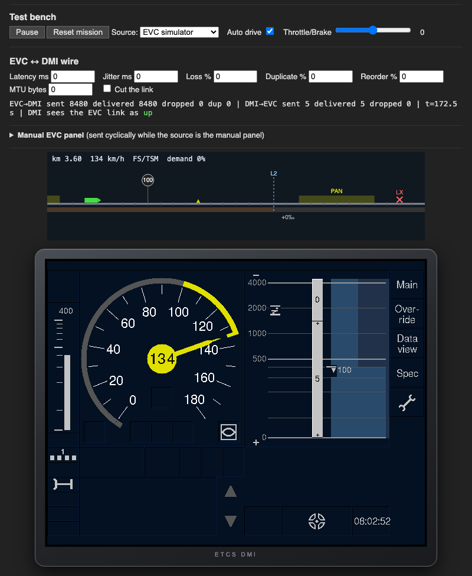
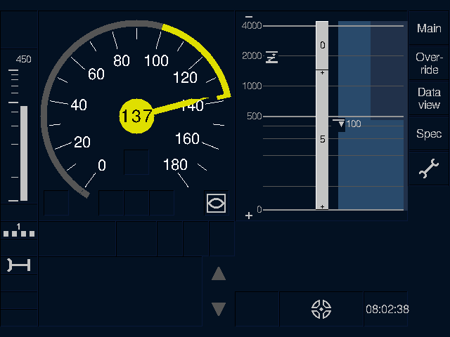
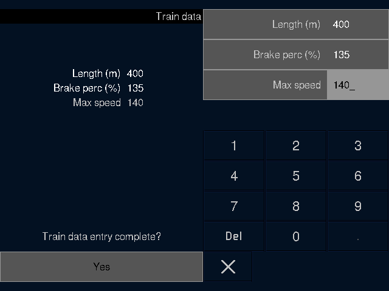

# etcs-dmi

## European Train Control System - Driver Machine Interface (ETCS DMI)

The DMI is the cab display that tells a train driver how fast the train
may go, where it has to brake, which mode and level the on-board system
is in, and what lies ahead on the track. This is an implementation of it
in Ada 2012 for small embedded hardware.

Since September 2026 the repository also hosts the second half of the
on-board system: an **ETCS on-board (EVC)** implementing SUBSET-026
v4.0.0, written in SPARK/Ada for the TI Hercules TMS570 family, under
[evc/](evc/). It is being built in phases, see
[doc/EVC-PLAN.md](doc/EVC-PLAN.md); the DMI is complete for its scope.

**Live demo**: <https://milanredele.github.io/etcs-dmi/> runs the DMI
and a simulated on-board computer in the browser, compiled from the same
Ada sources to WebAssembly.

[](https://milanredele.github.io/etcs-dmi/)

### Goals
1. **Implement Version 4.0.0 of the
   [ETCS DMI](https://en.wikipedia.org/wiki/European_Train_Control_System#Man_Machine_Interface)**
   according to the
   [specifications published by the European Union Agency for Railways](https://www.era.europa.eu/activities/technical-specifications-interoperability_en#meeting7)
   (ERA_ERTMS_015560 v4.0.0, included under [doc/SRS](doc/SRS) together
   with the system specification it refers to,
   [SUBSET-026 v4.0.0](doc/SRS/SUBSET-026_v400/README.md)).
   Written in Ada 2012 with a strong focus on applicability in
   resource-limited embedded devices: the primary performance goal is to
   run on a 32-bit 200 MHz ARM/POWER MCU with 128 kB RAM and 1 MB ROM,
   without an OS.
2. **Learn Ada.** My personal goal is to get better at Ada by
   implementing a well-specified and potentially useful application.
3. **Test the use of agentic AI in reliable software development.** Since
   the v4.0.0 update (commit `e0c7394`, August 2026) the code has been
   written with an AI coding agent
   ([Claude Code](https://claude.com/claude-code)) that plans, writes,
   builds and tests on its own over many steps, under my direction and
   review; those commits carry a `Co-Authored-By` trailer. A DMI is a
   good test case: the specification is long, precise and public, the
   language is made for safety, and mistakes show up on the screen.

4. **Implement the ETCS on-board itself** (SUBSET-026 v4.0.0) with the
   same discipline, in SPARK where the code is safety relevant, with a
   proof of the absence of run-time errors, and runnable on a TI Hercules
   safety microcontroller (TMS570LC4357).

See [PLAN.md](PLAN.md) for the implementation status and roadmap of the
DMI and [doc/EVC-PLAN.md](doc/EVC-PLAN.md) for those of the on-board.

### Working with an AI agent
The question behind the third goal is what it takes to trust the result.
The rules that have proven necessary so far:

- **The specification is the only authority.** It is in the repository
  as searchable text
  ([doc/SRS/…/sections](doc/SRS/ERA_ERTMS_015560_v400/sections)), and the
  code cites the clause it implements. An early gap analysis that was
  not checked against the text turned out to be wrong in most of its
  claims, including requirements that do not exist; [PLAN.md](PLAN.md)
  §1 records the check claim by claim, and a verified plan replaced it.
- **Behaviour is pinned by executable checks.** The regression
  runner makes 2156 checks: 295 rendered screens compared with golden
  frames, sound events, and a complete simulated mission. The
  WebAssembly build has to render the same pixels as the native one. A
  change that alters a screen fails a check, and a person has to look at
  the new frame before it becomes the golden one.
- **Where the specification is silent, the choice is written down as a
  choice**, not dressed up as a requirement (see *EVC link supervision*
  below).
- **Small steps.** One phase per commit, the plan kept up to date, and
  the standing rules for agents in [AGENTS.md](AGENTS.md).

This is an experiment, not a certified development process; nothing here
claims conformance with EN 50128 / EN 50716.

### Status
The default window (speed dial, supervision colours, planning area,
track conditions, text messages, acknowledgements, sounds), the sub-level
windows with the chapter 10 data entry (numeric, alphanumeric and
dedicated keyboards, data checks, validation, data view), the radio,
VBC, ATO selector, System version and Language windows (English,
German and Hungarian), the ATO displays of chapter 8.5, the chapter 15 message
catalogue, the desk inputs for Settings and isolation, touch input, and
the EVC/track/train simulator (with an ATO on-board, shunting,
Supervised Manoeuvre and a stand-in RBC) are implemented. The pixel
geometry of the speed dial, the distance bar and the frames follows the
figures cell by cell. Still open: the optimisation for the embedded
memory budget and the open points listed in the audit. The national systems part of the specification
(NTC, chapters 9 and 12) and the soft-key variant of the layout are out
of scope.

The code was audited against the specification clause by clause in
September 2026: [doc/AUDIT-2026-09.md](doc/AUDIT-2026-09.md) records
every gap found, and [PLAN.md](PLAN.md) §7 is the prioritized backlog.
Its first two blocks are closed: nothing the EVC sends can stop the DMI
any more (P0), and what is shown and sounded follows the clauses (P1).
The data entry dialogue follows chapter 10 (P2). Next are the missing
functions (P3): ATO displays, the message catalogue, the remaining windows.

| | |
|---|---|
|  |  |
| Target speed monitoring: braking towards a 100 km/h restriction, planning area on the right | Train data entry in the start-up dialogue |

### Zero dependency
No library is used other than provided by GNAT.

### Building
The project uses the [Alire](https://alire.ada.dev/) package manager. To build the project, run:
```bash
alr build
```
On macOS, if the link step fails with `library not found for -lSystem`,
point the Alire GNAT at the current SDK first:
```bash
export SDKROOT=$(xcrun --show-sdk-path) LIBRARY_PATH=$(xcrun --show-sdk-path)/usr/lib
```

### Fonts & Symbols
Fonts are embedded as bitmaps in source code. FreeSans font is used due to licensing issues and due to similarity to Helvetica (which is recommended by the ERA).
A FreeType based C program ([utils/ttf2ada.c](utils/ttf2ada.c)) generates the Ada packages from the TrueType font; [utils/gen_fonts.sh](utils/gen_fonts.sh) makes this reproducible: it fetches GNU FreeFont release 20120503, checks its digest and renders FreeSans unhinted, so that the capital letters are exactly as high as 5.1.2.2 asks for each use (10, 12, 16, 17 and 18 cells). Every size carries the printable ISO 8859-1 characters, the encoding of trackside text messages, and Latin Extended-A for the fixed texts of the languages that need it (Hungarian among them); the five fonts take about 55 kB of ROM. The bold style is a real bold font, FreeSansBold from the same release (its digest pinned too), rendered at the one height it is asked at, 12 cells: the text messages of the first group (8.2.3.4.7 c) and the '.' of a keyboard (5.1.2.1.5); it adds about 9 kB. Texts are measured with the font they are drawn with, and the width of a text is its ink: a last glyph whose ink reaches past its advance ('y', '/') counts with it, so no text reaches the margin of its area. It is easily replaceable with another font if needed.

Symbols are also embedded as source code. Note: the official bmp files attached to the ERA are 24 bit RGB and some contain other colors than those specified in the ERA - I consider these as errors, they typically look like jpeg or scaling artifacts. These were replaced with the proper color.

### Testing

Seven programs are built (`alr build`):
- `obj/dmi` — the DMI itself
- `obj/evc_sim` — an EVC/track/train simulator that drives the DMI
  through a complete mission (braking curves, monitoring transitions,
  level transition, track conditions, TAF, stop at the EOA)
- `obj/evc_onboard` — the ETCS on-board of [evc/](evc/) on the same hub
  port as the simulator, in the environment of the bench
  ([sim/sim_onboard_env.ads](sim/sim_onboard_env.ads): the balise
  groups of the demo line, an odometer with its error, the train
  interface and a train that obeys the on-board's brakes; see *The ETCS
  on-board on the bench* below)
- `obj/dmi_test` — the headless golden-frame regression runner
- `obj/dmi_fuzz` — the robustness fuzzer
- `obj/evc_test`, `obj/evc_fuzz` — the same two for the on-board
  (goldens under [test/golden/evc](test/golden/evc))

The on-board is also built alone by `etcs_evc.gpr`: `evc/prove.sh` runs
gnatprove on it (every unit is SPARK, no check may stay unproved) and
`ports/tms570/build.sh` cross-compiles it for the TI Hercules
TMS570LC43x with the toolchain that `ports/tms570/setup-toolchain.sh`
installs.

**Browser test bench** (everything in one page, no hub, no sockets):
the DMI and the EVC simulator are compiled to WebAssembly and run as
two separate modules with their own memories (a third module,
`onboard.wasm`, is the ETCS on-board: the *On-board* selector of the
page puts it in the simulator's place, see below);
[test/wasm/index.html](test/wasm/index.html) is the clock, the display
unit, the touch screen, the driver desk and the wire between them. The
wire is a configurable Ethernet stand-in: latency, jitter, loss,
duplication, reordering, fragmentation (MTU) and a "cut the link"
switch, with live statistics.
1. `test/wasm/build.sh` — builds `test/wasm/dmi.wasm`, `evc.wasm` and
   `onboard.wasm` with GNAT-LLVM and the AdaWebPack wasm32 runtime:
   - natively on an Apple Silicon Mac, once
     [test/wasm/setup-native-toolchain.sh](test/wasm/setup-native-toolchain.sh)
     has installed the toolchain under `~/.local/share/etcs-dmi/adawebpack-native`
     (`$ETCS_TOOLS`): AdaWebPack 24.0.0 rebuilt from the sources of its
     release (gnat-llvm, the GCC 14.1 front end, LLVM 16.0.4), pinned by
     digest; it needs the Alire GNAT and gprbuild, the Xcode command line
     tools and `brew install zstd`, and takes a few minutes once.
     A clean build then takes about 10 s instead of half an hour in the
     emulated container on the same Mac, and gives the same bytes;
   - otherwise in a Docker container, the fallback and what CI uses (the
     image is built on first use, see
     [test/wasm/Dockerfile](test/wasm/Dockerfile); on Apple Silicon it
     runs under emulation). `WASM_NATIVE=0` forces the container,
     `WASM_NATIVE=1` the native toolchain.
2. serve the repository over HTTP, e.g. `python3 -m http.server 8000`,
   and open <http://localhost:8000/test/wasm/>

The [Browser test bench](.github/workflows/pages.yml) workflow builds
the modules, runs the cross-check below and publishes the page on GitHub
Pages: <https://milanredele.github.io/etcs-dmi/>
(`test/wasm/site.sh <dir>` assembles the same site locally).

`node test/wasm/screenshots.js` regenerates the bench screenshot above by
driving the page in headless Chrome.

`node test/wasm/smoke.js` replays regression scenarios through the
wasm modules and checks the rendered screens against the same golden
digests as the native runner: the two builds render pixel for pixel
the same. `node test/wasm/onboard_smoke.js` runs the bench scenario of
`evc_test` (`Scenario_Bench_Onboard`) on `onboard.wasm` and compares
the SHA-256 of the on-board's DMI frames with the one the native run
records ([test/golden/evc/bench_onboard.sha256](test/golden/evc/bench_onboard.sha256)):
the wasm on-board must send the same bytes.

**The ETCS on-board on the bench**: until phase E4 the DMI is driven by
the simulator `EVC_Mock` by default; the on-board of [evc/](evc/) runs
in an environment made for it in [sim/](sim/), shared by
`onboard.wasm`, `obj/evc_onboard` and `evc_test`:
- `Sim_Trackside` and `Sim_Telegrams`: the balise groups of
  `EVC_Track.Balise_Groups` (two balises each, linked), their telegrams
  built with the on-board's own encoder: 12 m in rear of the start the
  national values, the SSP, the gradients and the level 1 MA of the demo
  line, then linking, track conditions (neutral section, lower
  pantograph, tunnel stopping area), the order to level 2 (stored for
  E4), a TSR and a plain text;
- `Sim_Odometer`: the odometer samples and the balise stamps from the
  true movement of the antenna (3 m in rear of cab A), with a scale error
  (+1 ‰) and noise (±0.5 ‰) and honest over- and under-reading bounds
  (2 ‰ plus 1 cm per sample);
- `Sim_Vehicle`: the train interface: cab A active, the direction
  controller, the brake pipe pressure; the on-board's emergency brake,
  service brake and traction cut-off act on the train (`EVC_Train`: 1.2
  and 0.9 m/s² built up in 1 and 2 s), which brakes on its own when the
  on-board fails;
- `Sim_JRU`: the on-board's juridical records in a ring, as short texts;
- `Sim_Onboard_Env`: one `Step` is vehicle, odometer, balises, one
  cycle of the on-board, its outputs back to the vehicle and the DMI;
  the automatic driver (`EVC_Driver.Auto_Drive_Onboard`) follows the
  permitted speed of the on-board's MSG_SPEED_STATE.

The on-board powers up in Stand By and has no modes yet: moving without
a movement authority, its standstill supervision stops the train after
D_NVROLL; acknowledge the brake release (the page's panel sends the
DMI's acknowledgement frame: the DMI shows no acknowledgement request
during its start-up dialogue, which the on-board cannot end before E4)
and drive on. Once
the first balise group is read it supervises the movement authority to
the stop in front of its end. The page shows its mode and level, its
train interface commands and its last JRU records.

**Interactive session over TCP** (mimics the embedded setup where
framebuffer content is sent to the display driver; also the way to
attach a DMI running on real hardware):
1. `node test/tools/server.js` — the message hub (DMI tcp 1337, EVC tcp
   1338, browser ws 8080)
2. open [test/tools/client.html](test/tools/client.html) in a browser —
   renders the screen, forwards touch input, plays the DMI sounds and
   provides the driver desk (throttle / auto-drive) plus a manual EVC
   panel
3. `obj/dmi` and (for the simulator source) `obj/evc_sim`, or
   `obj/evc_onboard` for the ETCS on-board in its bench environment (the
   desk's throttle and auto-drive drive its train)

The DMI opens with the start-up dialogue (driver ID, level); then enter
the train data and the train running number from the Main window and
press Start to begin the mission.

**Robustness**: nothing the EVC or the touch screen sends may stop the
DMI, because the embedded and the wasm runtime cannot propagate
exceptions. `obj/dmi_fuzz [steps [seed]]` feeds the DMI core with random
messages, touches and ticks, renders after every step and reports every
raise site with the message that caused it;
`node test/wasm/fuzz.js [steps [seed]]` does the same against the wasm
module. A defect that still slips through ends in the failure picture of
`DMI_Core.Enter_Failure` (system failure symbol on a blank screen), not
in a frozen display.

**Regression tests**: `obj/dmi_test` drives the DMI core and the EVC
simulator in process (no sockets) and compares SHA-256 digests of the
rendered screens against [test/golden](test/golden). `UPDATE=1
obj/dmi_test` re-records the goldens after an intended rendering change;
failing checks dump the frame as `*.actual` for inspection, `DUMP=1`
dumps every checked frame, and
[test/tools/frame2png.py](test/tools/frame2png.py) turns a dump into a
PNG.

**EVC link supervision**: the DMI specification does not cover the
DMI–EVC interface, it only defines how a system failure is presented
(8.2.3.1.2, symbol MO18) and that any other means is acceptable when
MO18 cannot be shown (8.2.3.1.2.1). The DMI therefore treats an EVC
that falls silent for longer than
`General_Parameters.EVC_Link_Timeout_Ms` (1 s) as failed: the picture
the EVC provided is discarded and mode SF is shown until the EVC talks
again. Frame reassembly from any byte transport lives in
[common/dmi_link.ads](common/dmi_link.ads), shared by the TCP mains, the wasm
modules and, later, the target's Ethernet driver.
